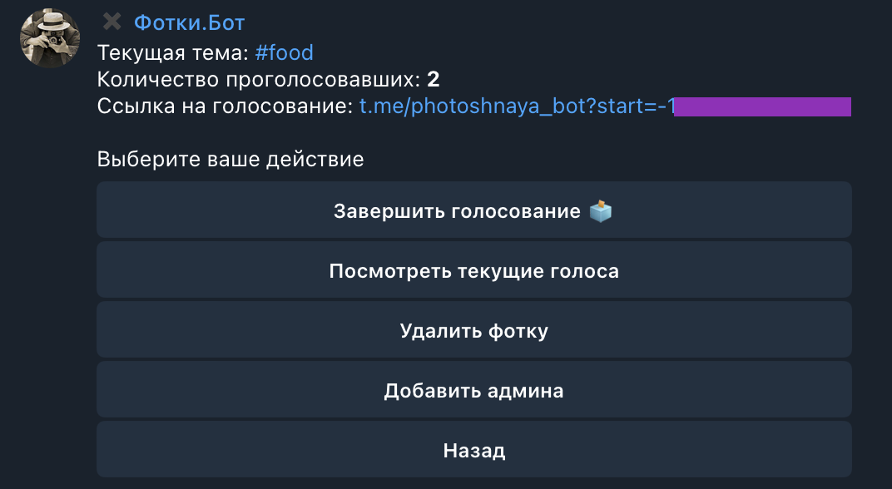
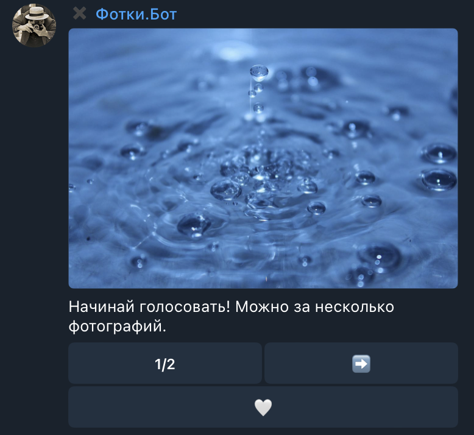
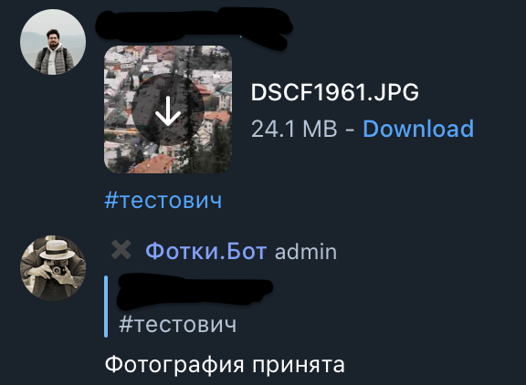

# Photoshnaya
Telegram-based application for photo-contests in group chats. Allows for instant photo registration and tracks contest themes with #. Also includes an admin menu for easy management and a leaderboard for tracking results.
To access the bot, use the @Photoshnaya_bot handle or go to How to Use section for self-host.

## Features

-  Instant photo registration through contest themes followed by #
-  Restricts user's photo registration to one per contest
-  Includes an easy-to-use admin menu at /admin
-  Uploads the winner's photo as the group chat photo
-  Tracks results and generates a leaderboard for both winners and participants

## How to Use:

   1) Clone the repository and rename env.example to .env.
   2) Fill in the bot token and postgre_url in the .env file.
   3) Start the application by using docker-compose up --build -d.
   4) Shutdown the application with docker-compose down.

## System Requirements:

- This application should work on any platform that supports Docker.

## Screenshots:

- 
- 
- 
