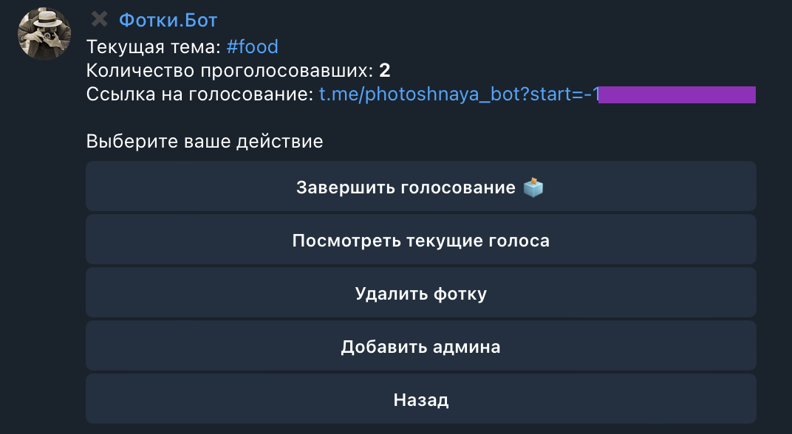
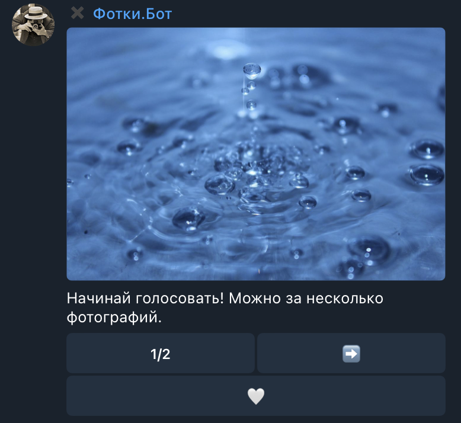
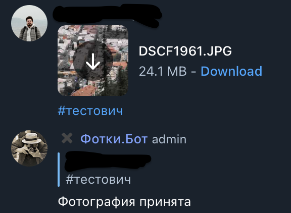

# Photoshnaya

[](https://pycqa.github.io/isort/)
[](https://github.com/psf/black)


Telegram-based application for photo-contests in group chats. Allows for instant photo registration and tracks contest themes with #. Also includes an admin menu for easy management and a leaderboard for tracking results.

To access the bot, use the [@photoshnaya_bot](t.me/photoshnaya_bot) handle or go to [How to Use](#how-to-use) section for self-host.


## Features

-  Instant photo registration through contest themes followed by #
-  Restricts user's photo registration to one per contest
-  Includes an easy-to-use admin menu at /admin
-  Uploads the winner's photo as the group chat photo
-  Tracks results and generates a leaderboard for both winners and participants

## Dependency management (uv)

- Source of truth: `pyproject.toml` + `uv.lock`.
- `requirements.txt` is kept temporarily and marked deprecated.
- Python version: `3.11`.

### Local development

```bash
uv venv --python 3.11
uv sync --frozen --extra dev
uv run python app/bot.py
```

### Local checks

```bash
uv run python -m compileall app
uv run python -c "import sys; sys.path.insert(0, 'app'); import bot; print('smoke-import-ok')"
```

## Docker setup

### Dockerfiles

- `Dockerfile.prod`: production image without dev/test dependencies.
- `Dockerfile.dev`: development/testing image with dev dependencies.

### Compose profiles

- `docker-compose.yml`: production-style app container only (no bundled Postgres service).
- `docker-compose.dev.yml`: app + Postgres + Redis for local development.
- `docker-compose.test.yml`: app + Postgres for tests.

### Run commands (always build image)

```bash
docker compose -f docker-compose.yml up --build
docker compose -f docker-compose.dev.yml up --build
docker compose -f docker-compose.test.yml up --build --abort-on-container-exit --exit-code-from web
```

### Make targets

```bash
make prod-up
make dev-up
make test
```

## Environment variables

Copy `.env.example` to `.env` and set:

- `token`: Telegram bot token from BotFather (required).
- `ps_url`: PostgreSQL URL used by runtime bot process (required in prod/dev runtime).
- `testps_url`: PostgreSQL URL for tests (required for test runs).

Example:

```bash
cp .env.example .env
```

## How to use

1. Create `.env` from `.env.example`.
2. Fill in `token`, `ps_url`, and `testps_url`.
3. Start the stack you need with `docker compose ... up --build`.
4. Switch off Group Privacy for the bot via BotFather menu.
5. Add the bot to the needed group and grant administration rights.
6. Stop with `docker compose ... down`.

## System Requirements:

- This application should work on any platform that supports Docker.

## Screenshots:




